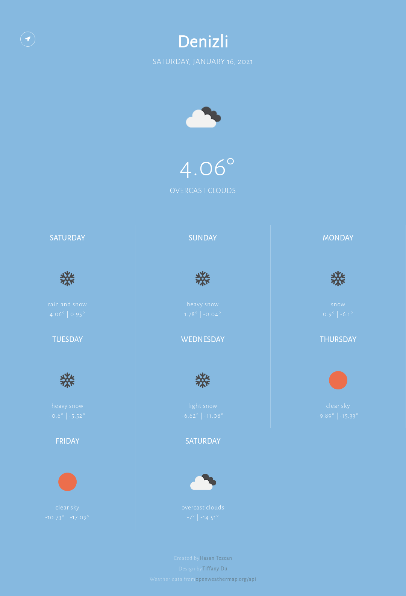

### `Kodluyoruz Earlybird Front-End Talent Bootcamp`

## Ödev 3 - `Hasan Tezcan`

**Bootcamp boyunca aldığım tüm notlar:** https://github.com/hasantezcan/kodluyoruz-react-bootcamp

---

### **Önizleme:** 
- https://kodluyoruz-odev-3-wheather-app.netlify.app  
    

### **Ekran görüntüsü:**

### Görev:
- Sizden genel olarak bir hava durumu uygulaması geliştirmenizi bekliyorum. Türkiye'nin tüm illerinin bir haftalık hava raporunu görüntüleyebilmeliyiz.

Ekran aşadağı görseldeki gibi olacaktır.

## Gereksinimler

- [x] Uygulama, Context API kullanılarak geliştirilmelidir.
- [x] Hava raporunda görüntülenen veriler tamamen gerçeği yansıtmalıdır. Hava durum bilgilerine erişmek için [OpenWeather API](https://openweathermap.org/api) kullanılabilir. Veya dilediğiniz farklı bir API'ı da kullanabilirsiniz.
- [x] Hava raporu, içinde bulunduğumuz günden başlayarak önümüzdeki bir haftalık süreci yansıtacaktır. Yukarıdaki görseli referans alabilirsiniz.
- [ ] Sayfa ilk açıldığında varsayılan olarak dilediğiniz herhangi şehrin hava durumunu gösterebilirsiniz. Bu noktada yapmak isteyenler için kullanıcıdan konum erişim izni istenerek bulunduğu şehrin bilgileri varsayılan olarak gösterilebilir.
- [x] Yine yukarıdaki görselde görüleceği üzere, içinde bulunduğumuz gün bir background ve border ile belirginleştirilmelidir.
- [x] Günlerin listelendiği kartlarda gün adı, hava durumu görseli(güneşli, yağmurlu, karlı, parçalı bulutlu), en yüksek ve en düşük sıcaklık gösterilmelidir.
- [ ] Bir dropdown aracılığı ile farklı bir şehrin hava raporuna ulaşılabilmelidir. 
- [x] Uygulama [Netlify](https://www.netlify.com/) üzerine deploy edilmelidir.
- [x] Uygulama önizleme bağlantısı README dosyasının en üst satırında belirtilmelidir.
> Tasarımı dilediğiniz gibi yapabilirsiniz.
